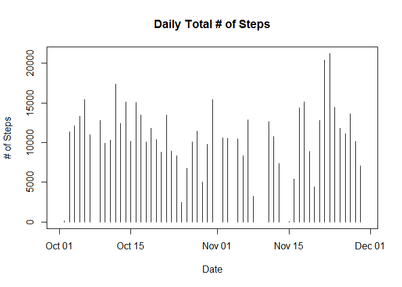
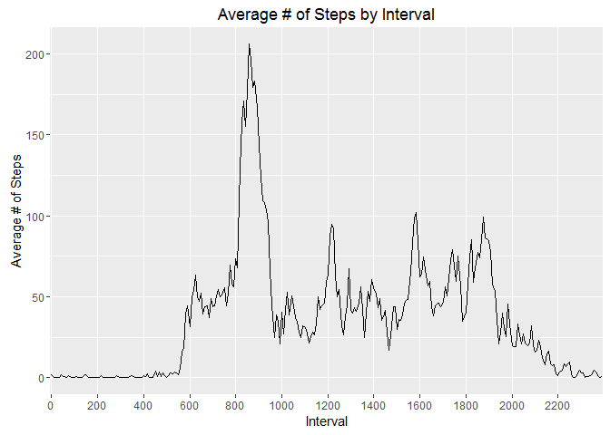
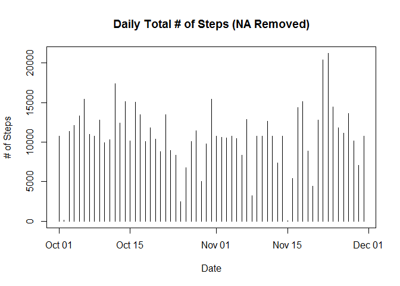
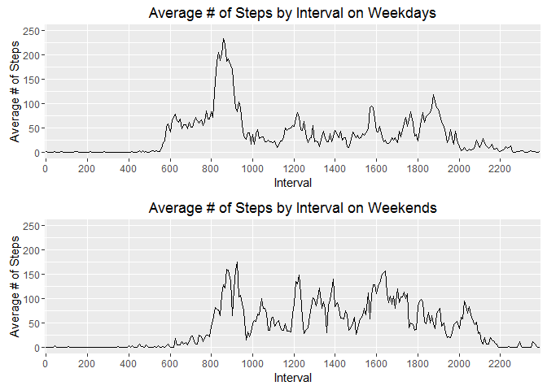

# Reproducible Research: Peer Assessment 1


## Loading and preprocessing the data

The required libraries for the processing is first loaded.


```r
# Load required libraries
library(plyr)
library(dplyr)
library(Rmisc)
library(ggplot2)
library(knitr)
```

The data file is uncompressed and read stored in the variable 'activity'.
After being read in the uncompressed file is deleted.


```r
# Read in data
activity <- unzip("activity.zip") %>% read.csv()

# Delete files
if(file.exists("activity.csv")){file.remove("activity.csv")}
```

The data in the 'date' column is converted to POSIX date format & the 'interval' column is converted to factors.


```r
# Convert date column to POSIX Date format
activity$date <- as.Date(activity$date, format = "%Y-%m-%d")

# Convert interval columns to factors
activity$interval <- as.factor(activity$interval)
```

Check if data has been loaded in & format conversions were sucessful.


```r
str(activity)
```

```
## 'data.frame':	17568 obs. of  3 variables:
##  $ steps   : int  NA NA NA NA NA NA NA NA NA NA ...
##  $ date    : Date, format: "2012-10-01" "2012-10-01" ...
##  $ interval: Factor w/ 288 levels "0","5","10","15",..: 1 2 3 4 5 6 7 8 9 10 ...
```

## What is mean total number of steps taken per day?

Dataset is grouped based on date and the sum of each group is calculated to find the total number of steps taken on each day.

The data is then plotted a histogram.


```r
# Sum steps for each day
total_daily_steps <- summarise(group_by(activity, date), sum(steps))

# Plot the histogram
plot(total_daily_steps, type = "h", main = "Daily Total # of Steps", xlab = "Date", ylab = "# of Steps")
```

<!-- -->

Mean of total number of steps taken per day


```r
# Calculate mean of total number of steps taken per day
mean(total_daily_steps$`sum(steps)`, na.rm = TRUE)
```

```
## [1] 10766.19
```

Median of total number of steps taken per day


```r
# Calculate median of total number of steps taken per day
median(total_daily_steps$`sum(steps)`, na.rm = TRUE)
```

```
## [1] 10765
```

## What is the average daily activity pattern?

Data set is grouped by interval and the mean is calculated for each interval.


```r
# Find mean of steps for each interval
mean_steps_by_interval <- summarise(group_by(activity, interval), mean(steps, na.rm = TRUE))
colnames(mean_steps_by_interval)[2] <- "avg_steps"
```

Resulting the calculated means are plotted on a time series.


```r
# Plot the time series
ggplot(data = mean_steps_by_interval) +
  aes(x = interval, y = avg_steps, group = "interval") +
  geom_line() +
  scale_x_discrete(breaks = seq(0, 2355, by = 200)) +
  ylab("Average # of Steps") + xlab("Interval") + ggtitle("Average # of Steps by Interval")
```

<!-- -->

The interval with the highest average number of steps & its value is identified.


```r
# Find the interval with the highest average # of steps
max_avg_interval <- which.max(mean_steps_by_interval$avg_steps)
mean_steps_by_interval$interval[max_avg_interval]
```

```
## [1] 835
## 288 Levels: 0 5 10 15 20 25 30 35 40 45 50 55 100 105 110 115 120 ... 2355
```

```r
mean_steps_by_interval$avg_steps[max_avg_interval]
```

```
## [1] 206.1698
```

## Imputing missing values

The number of rows with missing values in the 'steps' column is identified.


```r
# Count number of NA entries
sum(is.na(activity$steps))
```

```
## [1] 2304
```

Each missing value is replaced with the mean of the interval that it belongs to and a new dataset 'with_means' is created.


```r
# Replace missing values with the mean for that interval accross all days.
with_means <- mutate(activity, steps = ifelse(is.na(steps)==TRUE, mean_steps_by_interval$avg_steps, steps))
sum(is.na(with_means$steps))
```

```
## [1] 0
```

Total number of steps taken during each day is plotted again without NA values & the earlier histogram (with NA) is plotted again to compare the values graphically.


```r
# Sum steps for each day with no NA values
total_daily_steps_w_means <- summarise(group_by(with_means, date), sum(steps))

# Plot the histogram with no NA values
plot(total_daily_steps_w_means, type = "h", main = "Daily Total # of Steps (NA Removed)", xlab = "Date", ylab = "# of Steps")
```

<!-- -->

```r
# Plot the histogram with NA values
plot(total_daily_steps, type = "h", main = "Daily Total # of Steps", xlab = "Date", ylab = "# of Steps")
```

<!-- -->

The new mean of total number of steps taken per day (no NAs) is calculated & compared to earlier values.


```r
# Calculate new mean of total number of steps taken per day (no NAs)
mean(total_daily_steps_w_means$`sum(steps)`)
```

```
## [1] 10766.19
```

```r
# Calculate mean of total number of steps taken per day (with NAs)
mean(total_daily_steps$`sum(steps)`, na.rm = TRUE)
```

```
## [1] 10766.19
```

The new median of total number of steps taken per day (no NAs) is calculated & compared to earlier values.


```r
# Calculate new median of total number of steps taken per day (no NAs)
median(total_daily_steps_w_means$`sum(steps)`)
```

```
## [1] 10766.19
```

```r
# Calculate median of total number of steps taken per day (with NAs)
median(total_daily_steps$`sum(steps)`, na.rm = TRUE)
```

```
## [1] 10765
```

The mean & median remain unchanged once the NA values are filled in using the mean value for the interval it belongs to.


## Are there differences in activity patterns between weekdays and weekends?

Create a new factor variable in the dataset with two levels – “weekday” and “weekend” indicating whether a given date is a weekday or weekend day.


```r
avg_steps_by_int_wk <- mutate(activity, is_weekend = ifelse(weekdays(activity$date) == "Saturday" | weekdays(activity$date) == "Sunday", "Weekend", "Weekday"))

avg_steps_by_int_wk$is_weekend <- as.factor(avg_steps_by_int_wk$is_weekend)

str(avg_steps_by_int_wk)
```

```
## 'data.frame':	17568 obs. of  4 variables:
##  $ steps     : int  NA NA NA NA NA NA NA NA NA NA ...
##  $ date      : Date, format: "2012-10-01" "2012-10-01" ...
##  $ interval  : Factor w/ 288 levels "0","5","10","15",..: 1 2 3 4 5 6 7 8 9 10 ...
##  $ is_weekend: Factor w/ 2 levels "Weekday","Weekend": 1 1 1 1 1 1 1 1 1 1 ...
```

The resulting dataset is grouped by the 'is_weekend' & 'interval' variables and mean of each group is calculated.


```r
avg_steps_by_int_wk <-  (group_by(avg_steps_by_int_wk, is_weekend, interval)) %>%
                        summarise(mean(steps, na.rm = TRUE))

colnames(avg_steps_by_int_wk)[3] <- "avg_steps"
```

Data set is subsetted based on whether it was recorded on a weekend or weekday.


```r
avg_steps_by_int_wkd <- subset(avg_steps_by_int_wk, is_weekend == "Weekday")

avg_steps_by_int_wnd <- subset(avg_steps_by_int_wk, is_weekend == "Weekend")
```

The two subsetted data sets are plotted together for comparison.


```r
plot_avg_steps_by_int_wkd <- ggplot(avg_steps_by_int_wkd) + aes(interval, avg_steps, group = "interval") +
                              geom_line() +
                              scale_x_discrete(breaks = seq(0, 2355, by = 200)) +
                              scale_y_continuous(limits = c(0,250)) +
                              ylab("Average # of Steps") + xlab("Interval") +
                              ggtitle("Average # of Steps by Interval on Weekdays")

plot_avg_steps_by_int_wnd <- ggplot(avg_steps_by_int_wnd) + aes(interval, avg_steps, group = "interval") +
                              geom_line() +
                              scale_x_discrete(breaks = seq(0, 2355, by = 200)) +
                              scale_y_continuous(limits = c(0,250)) +
                              ylab("Average # of Steps") + xlab("Interval") +
                              ggtitle("Average # of Steps by Interval on Weekends")

multiplot(plot_avg_steps_by_int_wkd, plot_avg_steps_by_int_wnd, cols = 1)
```

<!-- -->

By comparing the two graphs it can be concluded that on weekends the number of steps taken is lower on average. Step activity starts later on weekends as well. Step activity during weekends however are more consistent on average, whereas on weekdays there is a lot more variataion across intervals. We also see increase in activity later in the night on weekends.
